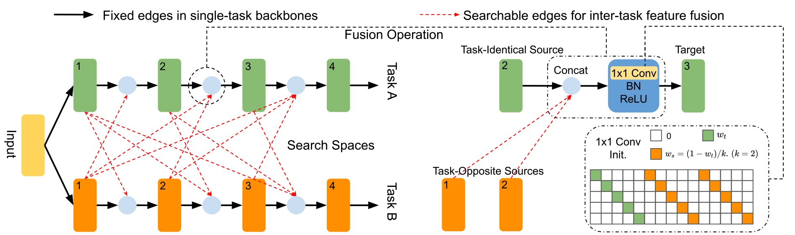

# MTL-NAS: Task-Agnostic Neural Architecture Search towards General-Purpose Multi-Task Learning
Official PyTorch Implementation of [MTL-NAS](https://arxiv.org/abs/2003.14058)

Please refer to our paper for more technical details:
> Yuan Gao*, Haoping Bai*, Zequn Jie, Jiayi Ma, Kui Jia, Wei Liu. MTL-NAS: Task-Agnostic Neural Architecture Search towards General-Purpose Multi-Task Learning, IEEE Conference on Computer Vision and Pattern Recognition (CVPR), 2020. [[arXiv]](https://arxiv.org/abs/2003.14058)



If this code is helpful to your research, please consider citing [our paper](https://arxiv.org/abs/2003.14058) by:

```
@inproceedings{mtlnas2020,
    title={MTL-NAS: Task-Agnostic Neural Architecture Search towards General-Purpose Multi-Task Learning},
    author={Yuan Gao and Haoping Bai and Zequn Jie and Jiayi Ma and Kui Jia and Wei Liu},
    year={2020},
    booktitle = {IEEE Conference on Computer Vision and Pattern Recognition (CVPR)}
}
```

## Setup
Install the necessary dependencies:
```sh
$ pip install -r requirements.txt
```

## Dataset
Follow the instruction [here](https://github.com/ethanygao/NDDR-CNN) to prepare the dataset. Alternatively, download the preprocessed dataset [here](https://drive.google.com/file/d/1JyTApScm6S5iz77uxH0qTaYtAhR6xxoj/view?usp=sharing). 
Download the converted PyTorch models from [here](https://drive.google.com/open?id=13caGJwskbeEgxGXYbdCH59a0FEWIWZnB), then create a `weights` directory and unzip the models inside.

When you are all set, you should have the following file structure:
```
datasets/nyu_v2/list
datasets/nyu_v2/nyu_v2_mean.npy
datasets/nyu_v2/nyu_train_val
weights/vgg_deeplab_lfov/tf_deeplab.pth
weights/nyu_v2/tf_finetune_seg.pth
weights/nyu_v2/tf_finetune_normal.pth
```

## Training
All the arguments to train/eval MTLNAS are shown in `configs/defaults.py`. The configuration files for different experiments are also provided in the `configs` directory. To run the NDDR-CNN baseline with VGG-16 architecture, simply call:

```sh
$ CUDA_VISIBLE_DEVICES=0 python tools/train.py --config-file configs/vgg/vgg_nyuv2_nddr.yaml
```

To run MTLNAS training with default configuration, call:

```sh
$ CUDA_VISIBLE_DEVICES=0 python tools/train_nas.py --config-file configs/ablation/vgg_nyuv2_default.yaml
```

## Evaluation
To evaluate the final checkpoint for the NDDR-CNN baseline experiment, call:

```sh
$ CUDA_VISIBLE_DEVICES=0 python tools/eval.py --config-file configs/vgg/vgg_nyuv2_nddr.yaml
```

To evaluate the final checkpoint for default MTLNAS, call:

```sh
$ CUDA_VISIBLE_DEVICES=0 python tools/eval_nas.py --config-file configs/ablation/vgg_nyuv2_default.yaml
```

You can download and extract the [final checkpoint](https://drive.google.com/file/d/1Hr6wjPM2X09ffouqoERyeK2--65NFSdm/view?usp=sharing) for default MTLNAS to `ckpts` directory and evaluate it by running the command above.
